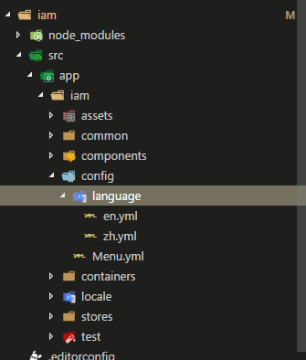

+++
title = "菜单配置"
data = "2018/1/11"
draft = false
weight= 4
+++ 

# 菜单配置

在Hap Cloud之前开发版本中，前端新加模块和页面，想在菜单中显示需要跟后端沟通各种事宜与配置，大大增加了开发效率与成本。在此版本中，只需要简单配置，菜单数据完全由前端控制。

以`iam`模块为例.



在模块内部创建`config`文件夹，目录结构为：

```
├── language
|   ├── en.yml
|   └── zh.yml
|
└── Menu.yml
```

文件 | 说明
--- | ---
language | 菜单中英文配置文件夹
en.yml | 英文菜单
zh.yml | 中文菜单
Menu.yml | 菜单配置项

Menu.yml文件内容看起来是这样的: 
```
"iam": # 此处为最外层的模块服务字段
  icon: account_circle # 服务的图标
  global: # global层的菜单
    - "role": # 菜单字段
        icon: assignment_ind # 菜单图标
        Routes: /iam/role # 菜单对应路由
        permission: # 菜单内容具有的权限
          - 'hap-user-service.role.update'
          - 'hap-user-service.role.delete'
          - 'hap-user-service.role.select'
          - 'hap-user-service.role.updateRoleWithPermission'
          - 'hap-user-service.role.createRoleWithPermission'
    -  "permission":
        icon: verified_user
        Routes: /iam/permission
        permission:
          - 'hap-user-service.permission.awesomeSelect'
    - "menu-management":
        icon: view_list
        Routes: /iam/menuTree
        permission:
          - 'hap-user-service.menu.menuOrganizations'
          - 'hap-user-service.menu.menuProjects'
          - 'hap-user-service.menu.menuGlobal'
    - "menu-permission":
        icon: security
        Routes: /iam/globalMenuPermission
        permission:
          - 'hap-user-service.menu.selectAll'
    - "member-role-global":
        icon: person_add
        Routes: /iam/globalMemberRole
        permission:
          - 'hap-user-service.member-role-global.delete'
          - 'hap-user-service.member-role-global.create'
          - 'hap-user-service.member-role-global.select'
          - 'hap-user-service.member-role-global.update'
    - "service":
        icon: next_week
        Routes: /iam/service
        permission:
          -  'hap-user-service.service.self'
          - 'hap-user-service.service.select'
  organization: # 组织层的菜单
    - "client":
        icon: laptop_mac
        Routes: /iam/client
        permission:
          - 'hap-user-service.client.create'
          - 'hap-user-service.client.update'
          - 'hap-user-service.client.delete'
          - 'hap-user-service.client.select'
    - "ldap":
        icon: device_hub
        Routes: '/iam/ldap'
        permission:
          - 'hap-user-service.ldap.updateSelf'
          - 'hap-user-service.ldap.query'
    - "password-policy":
        icon: verified_user
        Routes: /iam/password-policy
        permission:
          - 'hap-user-service.password-policy.updateSelf'
          - 'hap-user-service.password-policy.queryOrganization'
    - "user":
        icon: person
        Routes: /iam/user
        permission:
          - 'hap-user-service.user.updateUser'
          - 'hap-user-service.user.create'
          - 'hap-user-service.user.delete'
          - 'hap-user-service.user.select'
          - 'hap-user-service.user.query'
    - "project":
        icon: widgets
        Routes: /iam/project
        permission: 
          - 'hap-user-service.project.crete'
          - 'hap-user-service.project.update'
          - 'hap-user-service.project.delete'
          - 'hap-user-service.project.query'
          - 'hap-user-service.project.select'
    - "member-role-organization":
        icon: person_add
        Routes: /iam/origanizationMemberRole
        permission:
          - 'hap-user-service.member-role-organization.create'
          - 'hap-user-service.member-role-organization.delete'
          - 'hap-user-service.member-role-organization.update'
          - 'hap-user-service.member-role-organization.select'
    - "user-groups":
        icon: people
        Routes: /iam/userGroup
        permission:
          - 'hap-user-service.groups.update'
          - 'hap-user-service.user-groups.insertUserGroups'
          - 'hap-user-service.groups.delete'
  project: # 项目层的菜单
    - "member-role-project":
        icon: person_add
        Routes: /iam/projectMemberRole
        permission:
          - 'hap-user-service.member-role-project.create'
          - 'hap-user-service.member-role-project.delete'
          - 'hap-user-service.member-role-project.select'
          - 'hap-user-service.member-role-project.update'
  user: # 个人中心层的菜单
    - "user-info":
        icon: more
        Routes: /iam/user/info
        permission:
          - 'hap-user-service.user-info.querySelf'
          - 'hap-user-service.user-info.updateSelf'
    - "password":
        icon: grain
        Routes: /iam/user/modifyPwd
        permission:
          - 'hap-user-service.password-policy.queryOrganization'
          - 'hap-user-service.password-policy.updateSelf'
          - 'hap-user-service.password.updateSelf'
    - "token":
        icon: lock
        Routes: /iam/token
        permission:
          -  'hap-user-service.token.querySelf'
          - 'hap-user-service.token.create'
          - 'hap-user-service.token.deleteSelf'

```

en.yml文件内容：

```
"iam": IAM
"iam.client": "Client"
"iam.ldap": "LDAP"
"iam.member-role-global": "Role Assignment"
"iam.member-role-organization": "Role Assignment"
"iam.member-role-project": "Role Assignment"
"iam.menu-management": "Menu Setting"
"iam.organization": "Organization"
"iam.password": "Password Modification"
"iam.password-policy": "Password Policy"
"iam.permission": "Permission"
"iam.project": "Project"
"iam.role": "Role"
"iam.service": "Service"
"iam.token": "Authorization"
"iam.user": "User"
"iam.user-groups": "User Group"
"iam.user-info": "User Information Maintenance"
"iam.menu-permission": "Menu Permission"
```
模板为`[服务字段].[菜单字段]: [菜单英文名]`

zh.yml文件内容：
```
"iam": "用户服务"
"iam.client": "客户端"
"iam.ldap": "LDAP"
"iam.member-role-global": "角色分配"
"iam.member-role-organization": "角色分配"
"iam.member-role-project": "角色分配"
"iam.menu-management": "菜单配置"
"iam.organization": "组织"
"iam.password": "密码修改"
"iam.password-policy": "密码策略"
"iam.permission": "权限"
"iam.project": "项目"
"iam.role": "角色"
"iam.service": "服务"
"iam.token": "授权"
"iam.user": "用户"
"iam.user-groups": "用户组"
"iam.user-info": "用户信息维护"
"iam.menu-permission": "菜单权限"
```
模板为`[服务字段].[菜单字段]: [菜单中文名]`

在项目根目录下，执行`python .\boot\structure\configAuto.py iam`(确保python版本为2.7.x,以及本地安装pyyaml包)脚本。

成功之后在项目根目录会生成`config.yml`文件。

然后再执行`python ./boot/structure/pythonsql.py -i ip地址 -p 端口号 -u 用户名 -s 密码`

在部署时候也可通过环境变量进行传递参数 

变量名 | 说明
--- | ---
DB_HOST | 用户名
DB_PORT | 端口
DB_USER | 用户名
DB_PASS | 密码


成功后，会将前端配置的菜单信息插入后端数据库中。

*如果要显示插入的菜单，需要在全局层的菜单配置下，进行页面操作，将数据已有的菜单展示在菜单列。*
