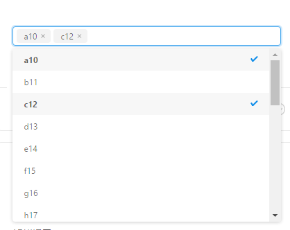

+++
title = "ANTD Select"
date = "2017-10-26"
draft = false
weight= 6
+++

ANTD Select
===========

-   弹出一个下拉菜单给用户选择操作，用于代替原生的选择器，或者需要一个更优雅的多选器时。
-   当选项少时（少于 5
    项），建议直接将选项平铺，使用[Radio](https://ant.design/components/radio-cn/)是更好的选择。

API
---

    <Select>
      <Option value="lucy">lucy</Option>
    </Select>

Select多选示例
--------------

1.  获取数据push或设定默认的Option
2.  onChange={handleChange}获取选中option的value，即可进行相关操作或传入后台



``` {.sourceCode .js}
import { Select } from 'antd';
const Option = Select.Option;

const children = [];
for (let i = 10; i < 36; i++) {
  children.push(<Option key={i.toString(36) + i}>{i.toString(36) + i}</Option>);
}

function handleChange(value) {
  console.log(`selected ${value}`);
}

ReactDOM.render(
  <Select
    multiple
    style={{ width: '100%' }}
    placeholder="Please select"
    defaultValue={['a10', 'c12']}
    onChange={handleChange}
  >
    {children}
  </Select>
, mountNode);
```

使用Select组件时需要首先在文件开始初使用import导入
树节点可以有很多，但在设置`checkable`时，将会花费更多的计算时间，因此我们缓存了一些计算结果（`this.treeNodesStates`）来复用，避免多次重复计算，以此提高性能。但这也带来了一些限制，当你异步加载树节点时，你需要这样渲染树：

>     {this.state.treeData.length
>       ? <Tree>{this.state.treeData.map(data => <TreeNode />)}</Tree>
>       : 'loading tree'}
>
> 关于Select组件的更多用法请参考ant
> design官网的api：<https://ant.design/components/select-cn/>
