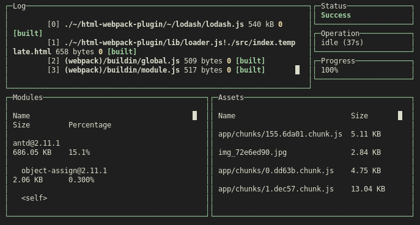

+++
title = "前端开发手册"
data = "2017-10-26"
draft = false
weight= 2
+++

前端开发手册
============

克隆代码
--------

可以新建一个 `hap-cloud-front` 的目录，进入到该目录下，在终端执行

    git clone -b release-1.0.0 https://xxxx@rdc.hand-china.com/gitlab/HAPCloud/HAPCloudFront.git --recursive

其中 `xxxx` 是你的工号。

(确保克隆之前设置了 `git config --global user.name`
`git config --global user.email` )

[git submodule
子模块操作](https://git-scm.com/book/zh/v1/Git-%E5%B7%A5%E5%85%B7-%E5%AD%90%E6%A8%A1%E5%9D%97)

[git config
配置操作](https://git-scm.com/book/zh/v1/%E8%87%AA%E5%AE%9A%E4%B9%89-Git-%E9%85%8D%E7%BD%AE-Git)

运行代码
--------

进入到 `boot` 目录下，右键 `git bash here` ,执行 `./npm.sh boot iam`
，成功之后,进入到 `boot` 继续执行 `node_modules/.bin/gulp` ，
如果已安装全局gulp，则可直接执行 `gulp`。(如果有其他模块xxx,执行
`./npm.sh xxx` )

不要关闭该终端(在iam等其他模块项目中源文件发生修改时，gulp会自动检测修改并同步)，同样在该目录下打开终端执行
`npm start` 启动项目，看到如图所示效果说明启动成功




**提示**: (可以通过 `gulp clean` 删除所有自动生成的文件,再通过 `gulp`
来重新生成，再重新启动 `npm start` ，这样可以解决有时页面未更新的状态)

查看效果
--------

在浏览器中键入 `localhost:9090/`

目录划分
--------

开发在iam项目下进行，源文件目录在 `iam/src/app/iam` ，主要目录结构如下：

``` {.sourceCode .js}
├── assets
│   ├── css
│   │   └── main.less
│   └── images
│       ├── jsa-128.jpg
│       └── menu.png
├── common
│   ├── axios.js
│   ├── HAP.js
│   ├── Icons.js
│   ├── RouterMap.js
│   └── store.js
├── components
│   ├── Header.js
│   ├── Label.js
│   ├── LabelService.js
│   ├── memberRole
│   │   ├── RoleList.js
│   │   └── RolePanels.js
│   ├── menu
│   │   ├── MainMenu.js
│   │   ├── MenuType.js
│   │   └── ResourceMenu.js
│   ├── PageHeader.js
│   └── Remove.js
├── containers
│   ├── Home.js
│   ├── IAMIndex.js
│   ├── Masters.js
│   ├── organization
│   │   ├── adminClient
│   │   ├── adminOrganization
│   │   ├── catalog
│   │   ├── client
│   │   ├── excel
│   │   ├── ldap
│   │   ├── lookup
│   │   ├── memberRole
│   │   ├── organization
│   │   ├── passwordPolicy
│   │   ├── project
│   │   ├── role
│   │   ├── service
│   │   ├── token
│   │   └── user
│   ├── project
│   │   ├── language
│   │   └── menberRole
│   └── UserPreferences.js
├── locale
│   ├── en.js
│   └── zh.js
└── stores
    ├── globalStores
    │   ├── AppState.js
    │   └── README
    ├── MenuStore.js
    ├── organization
    │   ├── adminClient
    │   ├── adminOrganization
    │   ├── catalog
    │   ├── client
    │   ├── excel
    │   ├── ldap
    │   ├── lookup
    │   ├── menberRole
    │   ├── organization
    │   ├── passwordPolicy
    │   ├── project
    │   ├── role
    │   ├── service
    │   ├── token
    │   └── user
    └── project
        └── language
```

`containers` 存放前端的页面

`stores` 存放前端页面所需的数据

`assets` 存放样式表和图片资源

`common` 存放公共的配置文件

`components` 存放的是公共的组件

`local` 存放多语言文件

文件命名方式
------------

1.文件夹命名

统一小写，比如模块 user。同一个模块的组件都放在同一个目录下，比如与 user
相关的 UserIndex, EditUser 等文件。

2.组件命名

采用帕斯卡命名规范，单个单词首字母大写，比如
User,多个单词仅首字母大写，比如 CreatUser

代码规范
--------

采用Alibnb规范 <https://github.com/airbnb/javascript>

1.代码注释

-   新建文件，头部进行注释。

``` {.sourceCode .js}
/*
author: xxx@hand-china.com
time: 2017-2-17
feature: 模块功能
*/
class User extends Component{
……
……
}
```

-   函数功能注释

``` {.sourceCode .js}
//feature:输出变量的值
function
inputDome(demo)
{
console.log(demo);
};
```
