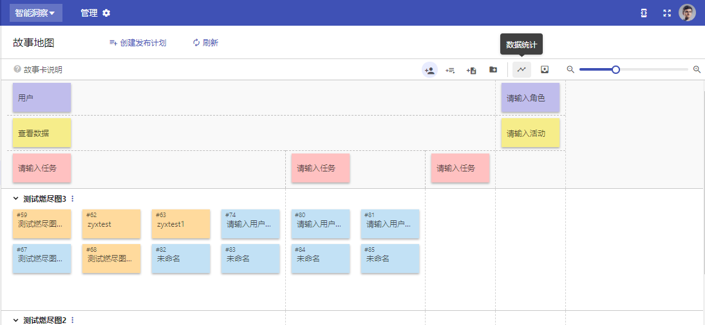
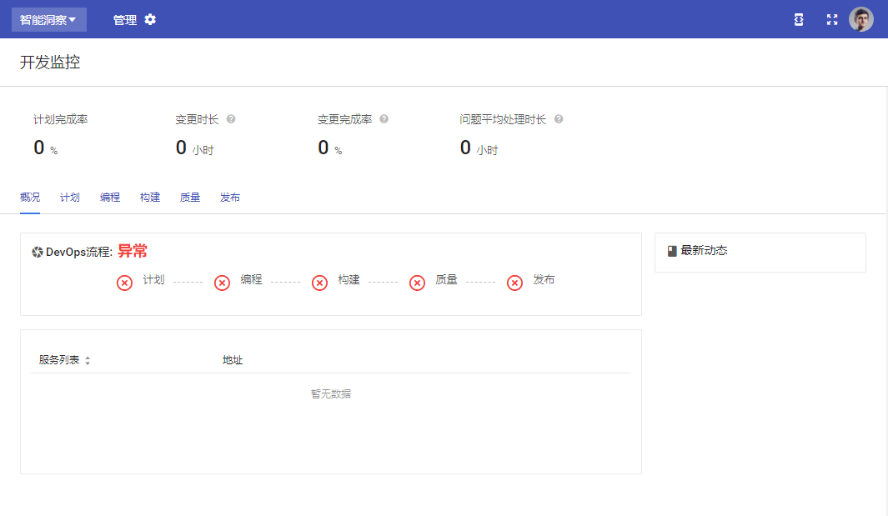
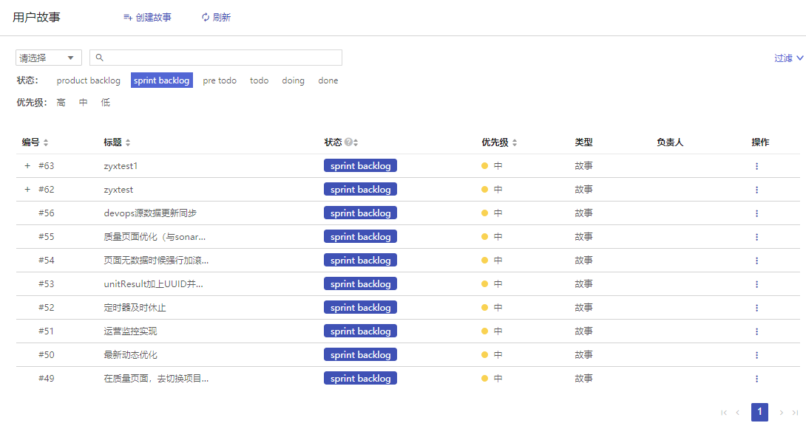
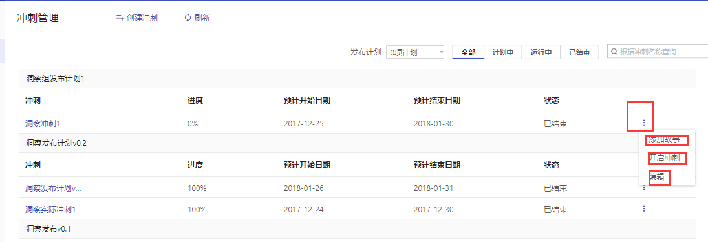
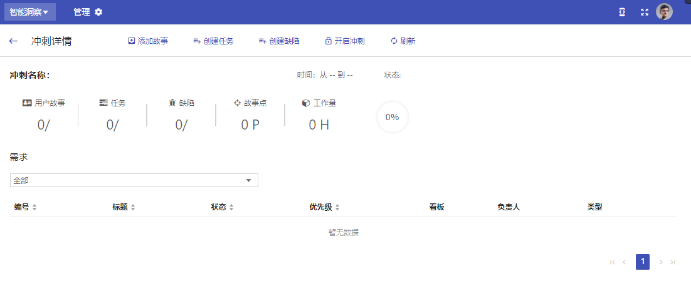
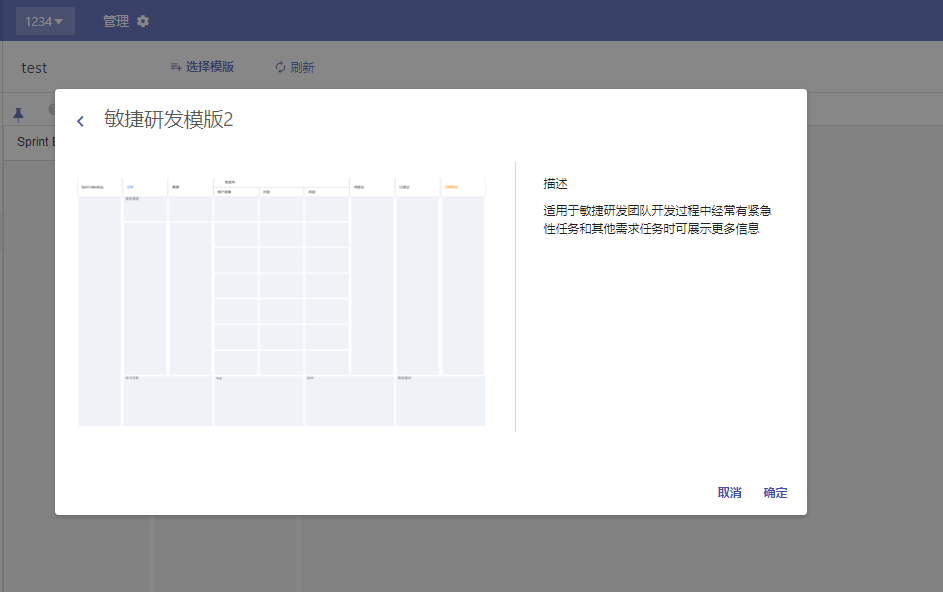
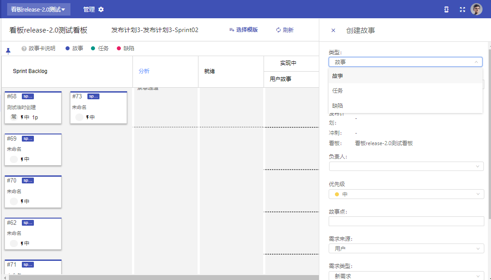

+++
title = "敏捷管理"
description = ""
weight = 2
+++

#  敏捷管理

   本页面介绍了用户使用敏捷管理时，如何使用用户故事地图、如何使用冲刺、如何使用看板以及如何操作用户故事、任务、缺陷。使用本页面，你可以了解：
   - [故事地图](#1)
   - [用户故事](#2)
   - [冲刺](#3)
   - [看板](#4)
   - [任务](#5)
   - [漏洞](#6)

<h2 id="1">故事地图</h2> 
  
  在开规划会议之前,用户可以按照角色,活动,任务分类来规划roadmap,整理用户故事,记录的用户故事将会被同步到gitlab的issue上,项目干系人可以在issue下放进行评论,对用户故事展开讨论。
  
  - **菜单层次**：项目层。
  - **菜单路径**：项目>敏捷管理>故事管理>故事地图。
  - **默认角色**：看板项目成员
  
 
###  使用故事地图 

1.  添加角色
    >角色:提出的用户需求是基于哪类角色考虑的。例如敏捷开发有三种角色，po，master和项目开发人员。
    
    点击<创建角色>鼠标光标会变为"加号",当出现"加号"图标时,用户在角色这一行任意位置单击,即可添加角色。  

    
  
1.  添加活动
    > 活动:基于某一个角色下，具体的用户场景。  
    点击<创建活动>鼠标光标会变为"加号",当出现"加号"图标时,用户在活动这一行任意位置单击,即可添加活动。  

1.  添加任务
    >任务:用户场景的细化。
  
    点击<创建任务>鼠标光标会变为"加号",当出现"加号"图标时,用户在任务这一行任意位置单击,即可添加任务。  

  
1.  创建发布计划
  
    点击<创建发布计划>,即可在用户故事地图上面生成对应的发布计划,依次默认命名为发布计划1,发布计划2...,如果想修改发布计划名称或者删除发布计划,点击发布计划名称旁边的三点符号,可进行修改或者删除。处于安全考虑,已经有用户故事的发布计划,需要先删除里面的用户故事,才能删除整个发布计划

    

  
1.  创建卡片  
  
    在故事地图界面移动鼠标,见到卡片创建的提示时,点击提示卡中间的文字部分,也可以创建相应的卡片,比如角色，活动，任务，用户故事。
    >用户故事:具体的需求。

    

    

    

1.  修改与删除卡片
    
    修改卡片直接单击卡片，弹出卡片详情信息时即可修改标题
    删除卡片需要在没有子卡的情况下才能删除，否则提示相应报错信息。
  
###   故事地图工具栏介绍  

  
1. 未规划区的使用
  
    点击<未规划区>,会出现一个侧边栏,如下图所示,在侧边栏中会放入您在其他界面创建的未选择发布计划的故事,比如您在用户故事界面创建了一个未选择发布计划的用户故事,就会以一张故事卡的形式出现在此处,顶部的搜索和过滤可以进行高级搜索,找到您想要的卡片,您考虑好此故事放在哪个发布计划下比较合适时,也可以拖动到具体的发布计划下。

    

    

  
1. 数据统计
  
    此项目下的数据进度的分析，可一键从此入口进入，也可去数据洞察界面选择具体项目查看。

    

    

  
1. 导出为图片
  
    点击<导出为图片>,即可把当前的地图以图片形式保存下来，导出格式为png。

    

  
1. 放大缩小
  
    点击放大搜索标志，或者拖动放大缩小的滚动条，都可完成整个地图的放大缩小。

    

<h2 id="2">用户故事</h2> 
  
  用户故事界面是用户故事的列表展现形式,在这里可以集中查看您创建的所有的用户故事,以及其下的任务缺陷等,方便快捷。
  
  - **菜单层次**：项目层。
  - **菜单路径**：项目>敏捷管理>故事管理>用户故事。
  - **默认角色**：看板项目成员
 

###  用户故事界面功能详解  

  
1.  创建故事
  
    点击<创建故事>,出现详情信息编辑的窗口,在窗口中进行编辑,编辑完成之后点击保存。

    

  
1.  高级搜索
  
    点击<过滤>可以进行高级搜索
    
    

  
1.  操作
  - 删除
    
    未进入冲刺的用户故事可以删除。
  - 快捷创建任务
    
    可以快捷创建用户故事下面的任务。
  - 快捷创建缺陷
    
    可以快捷创建用户故事下面的缺陷。

    
  
<h2 id="3">冲刺</h2> 
  
  在冲刺中，可方便为您管理一个迭代周期内要完成的故事，并为您进行后台数据监测，可视化故事完成的情况，冲刺作为用户故事地图和看板的衔接环节，开启冲刺之后才能使用看板的全部功能。
  
  - **菜单层次**：项目层。
  - **菜单路径**：项目>敏捷管理>冲刺管理>冲刺。
  - **默认角色**：看板项目成员

###  冲刺界面功能详解
  
1. 创建冲刺
  
    点击<创建冲刺>,选择发布计划,输入冲刺名称，选择预计的冲刺起止时间(不必输),即可创建一个新的冲刺。
  
    

  
1. 搜索
  
    可以在工具栏进行搜索。
  
    
  
1. 操作
    - 删除
      
      可以删除这个冲刺。
    - 状态切换
      
      可以快捷开启或者关闭冲刺，完成状态切换。
    - 编辑
      
      可以修改冲刺的具体信息。
      
    

 
1. 进入冲刺详情，点击冲刺的名称，即可进入冲刺详情。
    - 开启/关闭冲刺
      
      点击<开启冲刺>可开启当前冲刺,开启之后,数据洞察就开始记录当前冲刺的数据。冲刺内添加的故事也会自动导入看板中,并放在第一列。
      点击<关闭冲刺>可关闭当前冲刺，关闭之后不能再开启。
    - 添加故事
      
      选择故事来源,从故事地图,或者未规划的故事中,勾选需要导入的故事,点击确定,添加到冲刺中,添加进冲刺的故事,在故事地图界面的颜色会与没有导入冲刺的颜色有一个变化。
    - 创建任务
      
      可以创建进入到冲刺中的用户故事下的具体任务。
    - 创建缺陷
      
      可以创建用户故事下或者任务下测试出现的bug。
      
      
    - 筛选
      
      可以对故事，任务和缺陷进行分类筛选。
      
      
    - 操作
      
      可以把导入冲刺的故事移除，移除后不会在故事地图里面删除，只是故事地图中的卡片颜色会变为未导入状态。也可以导入到其他冲刺中。
      
      
  
<h2 id="4">看板</h2> 

  开启冲刺之后才能使用看板的全部功能。看板可以取代物理看板，也可以可视化您的工作流，同时后台会记录所以操作的时间数据，帮您完成数据分析和记录工作。
  
  - **菜单层次**：项目层。
  - **菜单路径**：项目>敏捷管理>冲刺管理>看板。
  - **默认角色**：看板项目成员
  
### 看板管理界面功能详解
  
1.  选择模板
  
    进入看板之后，先根据您的需要，选择一个看板模板，单击某个模板，可查看详情，双击就会为您选择当前模板并打开，看板界面没有卡片时，您也可以更换模板。

      

    
  
1.  使用看板
  
    进入看板之后，您在当前开启的冲刺中添加的故事，会自动为您导入到当前看板，并放在SprintBacklog里面（第一列）

   - 创建卡片
    
     点击<创建卡片>,出现卡片详情编辑的窗口,选择卡片类型,故事,任务,缺陷,可创建对应类型的卡片,创建的卡片会同步到故事地图界面,放在当前发布计划的第一个角色的第一个任务列里。

     
    
     

   - 看板绘制
      
      点击<看板绘制>进入看板编辑界面
      
      1)增加列
      
      2)绘制泳道
      
      3)增加/减少列高
      
      4)撤销/恢复
      
      5)保存
      
      6)在制品和起始列设置

     
    
   - 拖动故事卡
    
   - 故事卡的子卡(任务卡/bug卡)的操作
  
<h2 id="5">任务</h2> 

  可以查看您创建的所有任务，可视化您的任务流，同时后台会记录所以操作的时间数据，帮您完成数据分析和记录工作。
  
  - **菜单层次**：项目层。
  - **菜单路径**：项目>敏捷管理>任务和漏洞>任务。
  - **默认角色**：看板项目成员
  
### 任务管理界面功能详解
- 查看任务
  
  在任务界面,您可以查看您所有创建的任务,并且可以高级搜索您要找的任务。
- 操作
  
  可以在<操作>中完成删除,快捷创建缺陷的快捷操作

  
  
<h2 id="6">漏洞</h2> 
  
  可以查看您创建的所有漏洞。
  
  - **菜单层次**：项目层。
  - **菜单路径**：项目>敏捷管理>任务和漏洞>漏洞。
  - **默认角色**：看板项目成员
 
  
### 漏洞管理界面功能详解
  - 查看缺陷
    
    在任务界面,您可以查看您所有创建的缺陷,并且可以高级搜索您要找的缺陷。
  - 操作
    
    可以在<操作>中完成删除缺陷。

  

