# 系统配置

## 角色管理

  - **菜单层次**：全局层。
  - **菜单路径**：管理 > 角色。

  当API发送请求时，通过授予用户角色来授予适当的权限来使用资源，该篇介绍如何进行角色的创建与权限配置。

### 新建角色

1. 点击 `创建` 。

    

1. 输入 “角色名” ， “角色编码” ，设置是否可编辑以及是否启用，点击 `添加权限`。

    

    注：[API权限列表]()

1. 选择所需相应权限，点击 `确定` ，进行创建。

    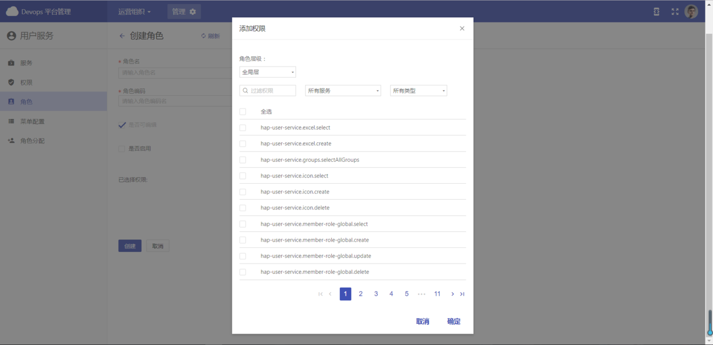

### 编辑角色权限配置

1. 针对已存在的角色，点击 `编辑` ，或者从详情界面点击 `编辑` 。

    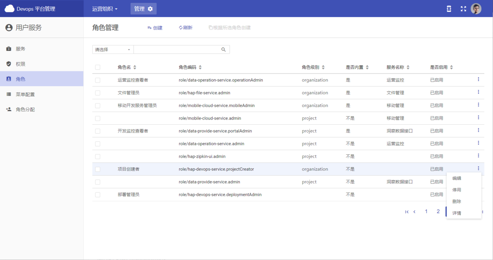

1. 对角色相关信息进行修改，以及权限进行修改，点击 `添加权限` 。

    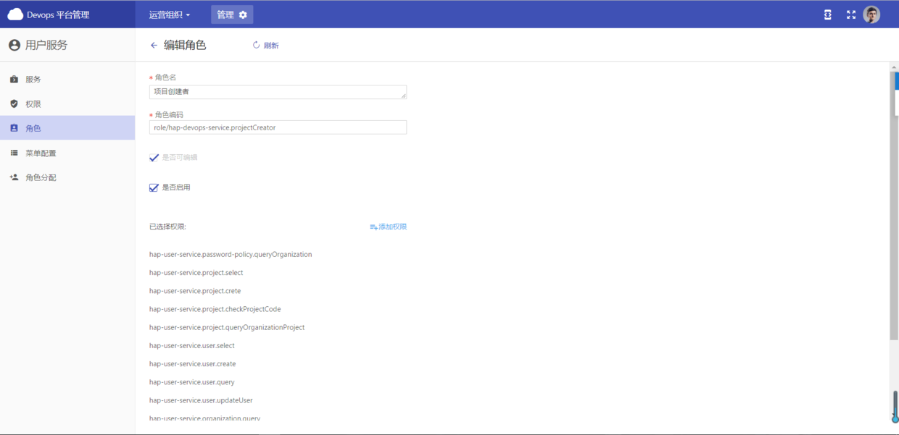

1. 添加或删除一个或多个权限，点击 `确定` 。

    

### 停用角色

- 点击 `停用` ，该角色将不可分配给用户。

  

### 启用角色

  > 点击 `启用` ，该角色正常使用，可以分配给相应用户。  
  注：现有角色需手动配置权限列表

### 角色权限说明

角色名称 | 权限名称 | 权限描述 | 权限层级
--- | --- | --- | ---
项目创建者 | hap-user-service.password-policy.queryOrganization | 查询目标组织密码策略 | organization
项目创建者 | hap-devops-service.environment.listEnvironment | 查询全部环境信息 | organization
项目创建者 | hap-devops-service.environment.createEnvironment | 创建环境 | organization
项目创建者 | hap-devops-service.environment.checkEnvironmentByName | 检查环境名是否可用 | organization
项目创建者 | hap-devops-service.environment.listEnvironmentByPageSize | 分页查询环境信息 | organization
项目创建者 | hap-devops-service.environment.getEnvironmentByEnvironmentId | 环境管理详情 | organization
项目创建者 | hap-devops-service.environment.updateEnvironment | 更新环境 | organization
项目创建者 | hap-devops-service.environment.deleteEnvironmentByEnvironmentId | 删除环境 | organization
项目创建者 | hap-devops-service.project.checkProject | 校验项目code,name是否重复 | organization
项目创建者 | hap-user-service.project.select | 分页查询项目 | organization
项目创建者 | hap-user-service.project.create | 添加项目，organization id不需要，强制当前用户所属organization | organization
项目创建者 | hap-user-service.project.checkProjectCode | checkProjectCode | organization
项目创建者 | hap-user-service.project.queryOrganizationProject | 根据组织id查询项目 | organization
项目创建者 | hap-user-service.user.select | 分页查询 | organization
项目创建者 | hap-user-service.user.create | 新增用户 | organization
项目创建者 | hap-user-service.user.query | 根据删除组织下所有用户 | organization
项目创建者 | hap-user-service.user.updateUser | 通过用户id查询用户 | organization
项目创建者 | hap-user-service.organization.query | 根据组织id查询组织 | organization
项目创建者 | hap-user-service.role.selectOrganizationRole | 查询可分配组织角色列表 | organization
项目创建者 | hap-user-service.project.update | 根据id修改项目信息，只能修改自己组织项目 | organization
项目所有者 | hap-user-service.project.query | 按照Id查询项目，只能查询自己组织项目 | project
项目所有者 | hap-user-service.member-role-project.select | 查询项目成员角色 | project
项目所有者 | hap-user-service.member-role-project.create | 项目层新增成员角色 | project
项目所有者 | hap-user-service.member-role-project.update | 更新项目层成员角色 | project
项目所有者 | hap-user-service.member-role-project.createSingle | 项目层新增成员角色 | project
项目所有者 | hap-user-service.member-role-project.delete | 删除项目层成员角色 | project
项目所有者 | hap-user-service.role.selectProjectRole | 查询可分配项目角色列表 | project
项目所有者 | hap-user-service.role.selectProjectRoleGroupByService | 查询可分配项目角色列表（查询结果以服务分组） | project
源代码管理员 | hap-user-service.project.query | 按照Id查询项目，只能查询自己组织项目 | project
项目成员 | hap-user-service.project.query | 按照Id查询项目，只能查询自己组织项目 | project
看板所有者 | hap-user-service.project.query | 按照Id查询项目，只能查询自己组织项目 | project
看板成员 | hap-user-service.project.query | 按照Id查询项目，只能查询自己组织项目 | project
开发监控 | hap-user-service.project.query | 按照Id查询项目，只能查询自己组织项目 | project
部署管理员 | hap-user-service.groups.select | 查询Group | organization
部署管理员 | hap-user-service.groups.create | 创建Group | organization
部署管理员 | hap-user-service.groups.query | 查询Group | organization
部署管理员 | hap-user-service.groups.update | 更新Group | organization
部署管理员 | hap-user-service.groups.delete | 删除Group | organization
部署管理员 | hap-user-service.user-groups.insertUserGroups | 创建userGroups | organization
部署管理员 | hap-user-service.user-groups.delete | 删除userGroups | organization

## 用户管理

  - **菜单层次**：组织层。
  - **菜单路径**：IAM > 用户管理。

  > 面向平台管理员提供用户管理功能，可以新建用户，进行用户信息维护等。  
   注：用户可由其他系统批量导入。

### 新建用户

1.  点击`创建`按钮。

    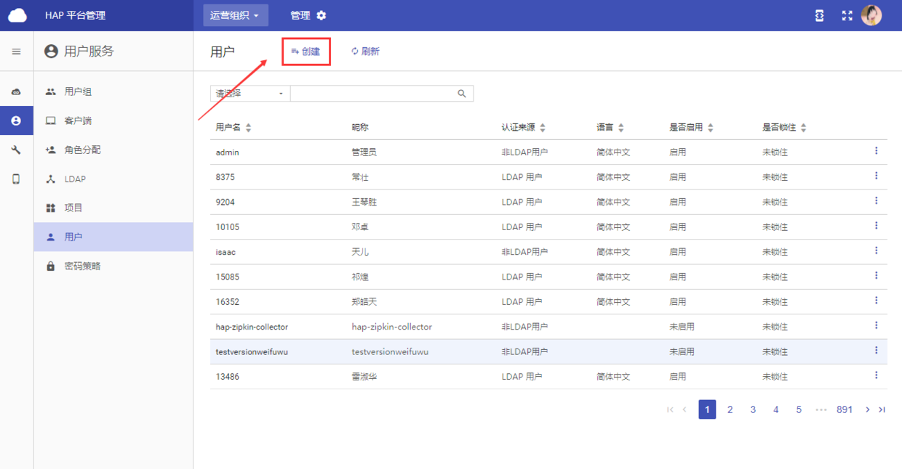

1.  输入用户相关信息，点击`创建`按钮，完成创建。

    

1.  新建的用户“张三”已在用户列表中，gitlab自动生成用户“张三”。。

    

### 查看用户详情

1.  点击`详情`，进入用户详情界面。

    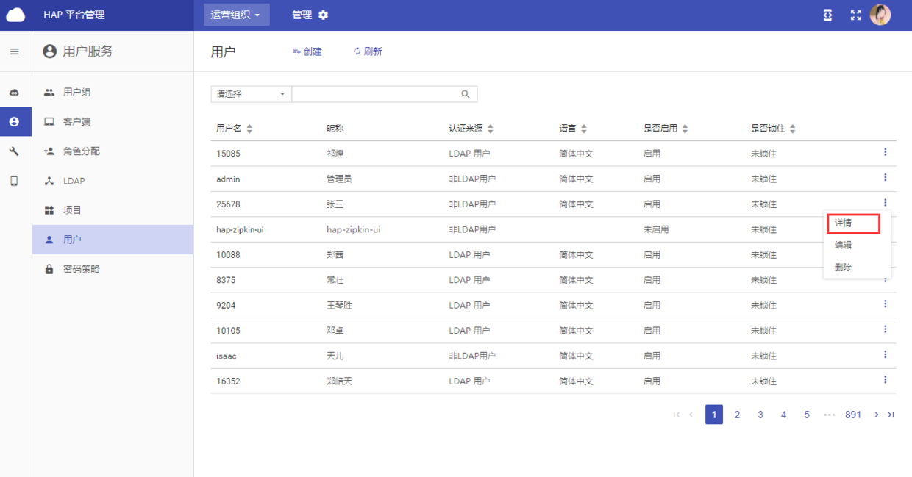

1.  查看所需信息。

    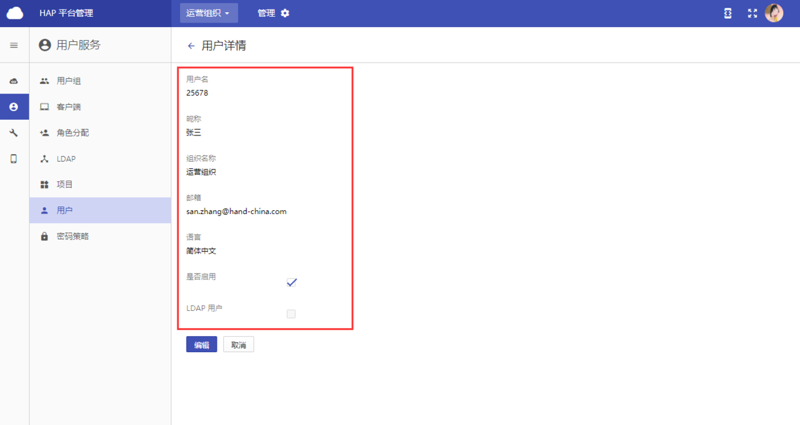

### 编辑用户信息

1.  点击`编辑`，进入用户编辑界面。

    

    或从用户详情界面点击`编辑`按钮，进入用户编辑界面。

    

1.  对用户信息进行修改，点击`保存`按钮，用户信息修改完成。

    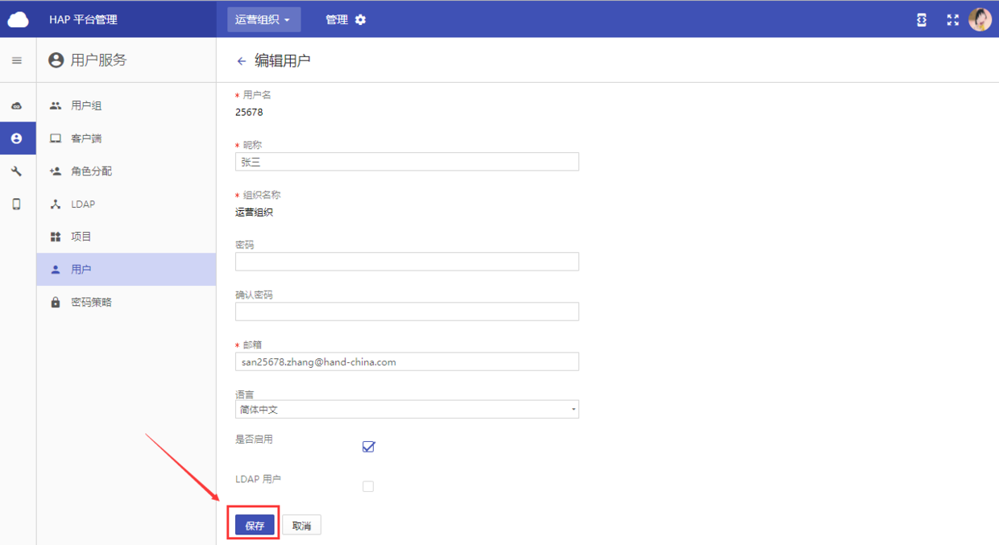

### 删除用户

1.  点击`删除`。

    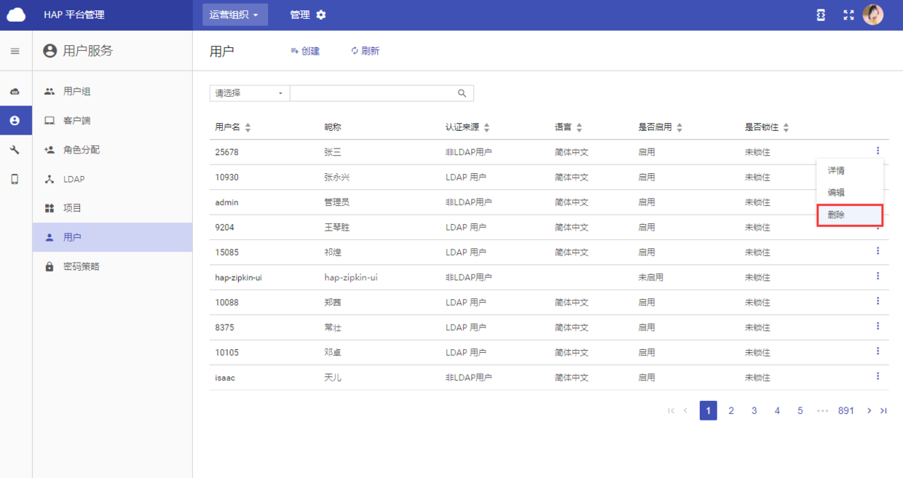

1.  再次点击`删除`按钮，用户删除成功。

    

## 角色分配

  - **菜单层次**：组织层/项目层
  - **菜单路径**：IAM > 角色分配。

  > 面向平台管理员、项目所有者提供的权限管理，可以在组织或项目内添加成员，为其分配适当的角色，也可以调整现有成员的角色，可以有适当的权限使用资源。

### 添加角色

1.  若需要分配的用户不在该组织/项目中，点击 `添加` 按钮进行角色添加。

    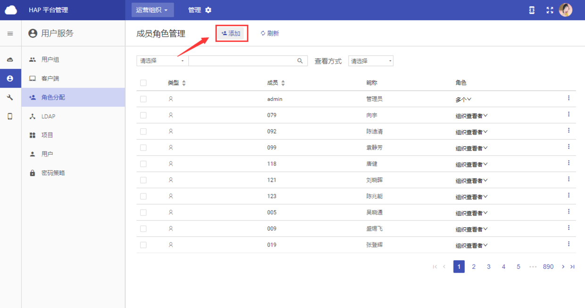

    例如：当用户“25777”不属于“演示项目0131”项目时，点击`添加`，输入用户名，为该用户分配角色权限。

    

1.  若用户存在于成员角色管理列表中，无需点击 `添加` ，点击 `▼` ，选择一个或多个角色进行分配。

    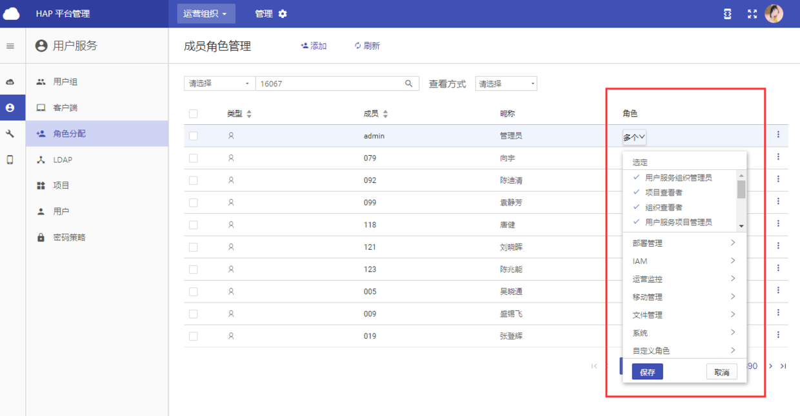

    例如，创建用户完成后，平台会自动分配 “组织查看者” 的角色，该用户存在于成员角色管理列表中，直接进行角色分配，点击 `保存` 按钮，完成角色修改。

    

    

_小tips：找不到用户怎么办？  
直接在搜索框内输入用户名或昵称，回车一下就搞定啦~_

  

注：**角色权限列表**

角色 | 权限 | 层级
--- | --- | ---
平台管理员 | 菜单管理、角色管理、用户管理（初始化导入）、角色分配（组织层）及除服务发布之外所有功能 | 系统层
项目创建者 | 用户管理、项目管理、环境管理、用户组管理 | 组织层
部署管理员 | 资源管理、网关管理、域名管理、服务管理、服务部署、部署详情（阶段及日志）、设置自动部署 | 组织层
项目所有者 | 角色分配（所在项目下）服务创建、服务详情查看、分支管理、服务版本、代码质量查看、服务发布、设置自动发布 | 项目层
源代码管理员 | 服务创建、服务详情查看、分支管理、服务版本、代码质量查看、服务发布 | 项目层
项目成员 | 服务详情查看、分支管理、服务版本、代码质量查看、服务发布 | 项目层
看板项目所有者 | 故事管理、冲刺管理、任务和缺陷 | 项目层
看板成员 | 故事管理、冲刺管理、任务和缺陷 | 项目层
开发监控查看者 | 全流程信息监控查看 | 项目层

### 删除角色

1.  点击 `删除` 。

    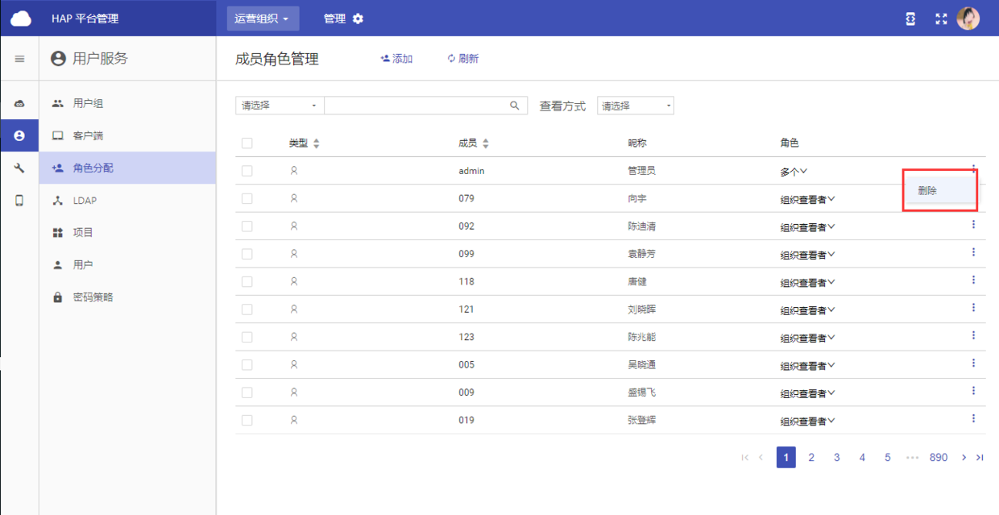

1.  点击 `删除` ，用户从该组织/项目移除成功。

    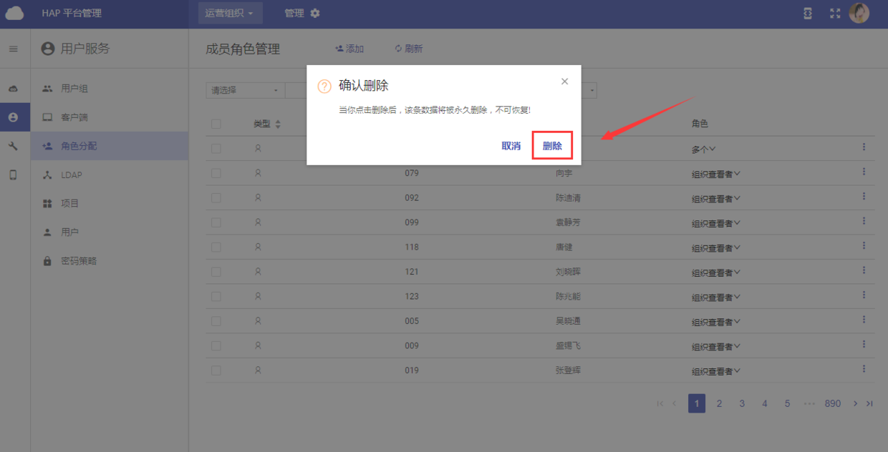

## 项目管理

  - **菜单层次**：组织层
  - **菜单路径**：IAM > 项目。

  > 根据企业产品研发情况拆分团队，建议采用敏捷项目管理团队为一个项目单位，项目管理可以提供项目创建、项目查询、项目编辑等功能。

### 新建项目

1.  点击 `创建` 按钮。

    

1.  输入 “项目编码” 和 “项目名称” ，点击 `创建` 按钮。

    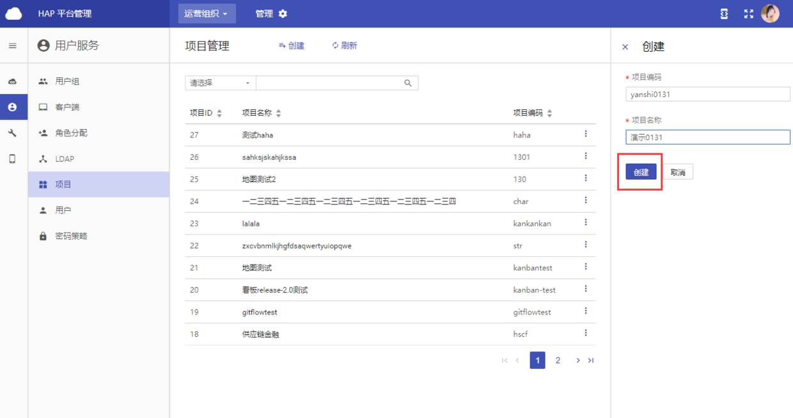

1.  新建项目 `“演示0131”` 已在项目管理列表中， gitlab自动对应生成group `“演示0131”` 。

    

### 编辑项目信息

1.  点击 `编辑` ，进入项目编辑界面。

    

1.  对 `“项目名称”` 进行修改，点击 `保存` 按钮。

    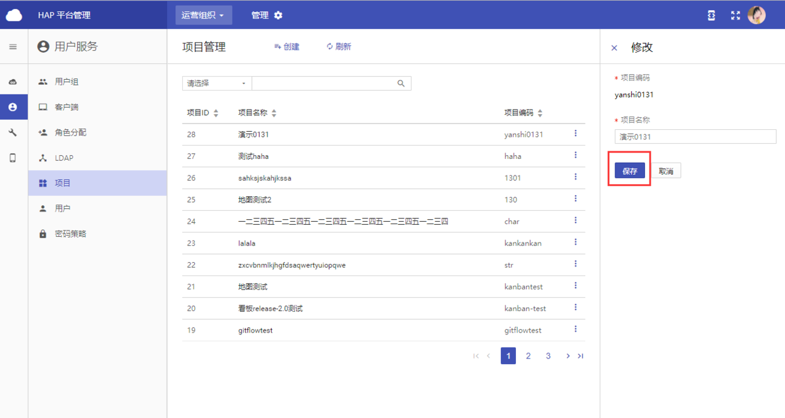

### 禁用/启用项目

点击 `禁用` ，项目禁用后，该项目下的其他操作将无法进行。。

  

### 启用项目

点击`启用`，启用后，该项目恢复正常使用。

  

## 环境管理

  - **菜单层次**：组织层/项目层
  - **菜单路径**：开发管理 > 环境。

  > 面向平台管理员和项目创建者，根据用途的不同配置相对应的环境信息。可以创建环境，删除环境，及对环境详情信息进行编辑修改。  
  常见环境包含：测试环境，UAT环境及正式环境等。

### 创建环境

1. 点击 `创建` 按钮。

    

1. 输入 “环境名称” 、 “环境地址” 以及 “环境密钥” ，点击 `测试连接` ，若环境地址、秘钥配置正确，会提示“连接成功”；若看到提示信息为“连接失败”，请修改为正确的环境地址或秘钥，点击 `创建` 按钮。

    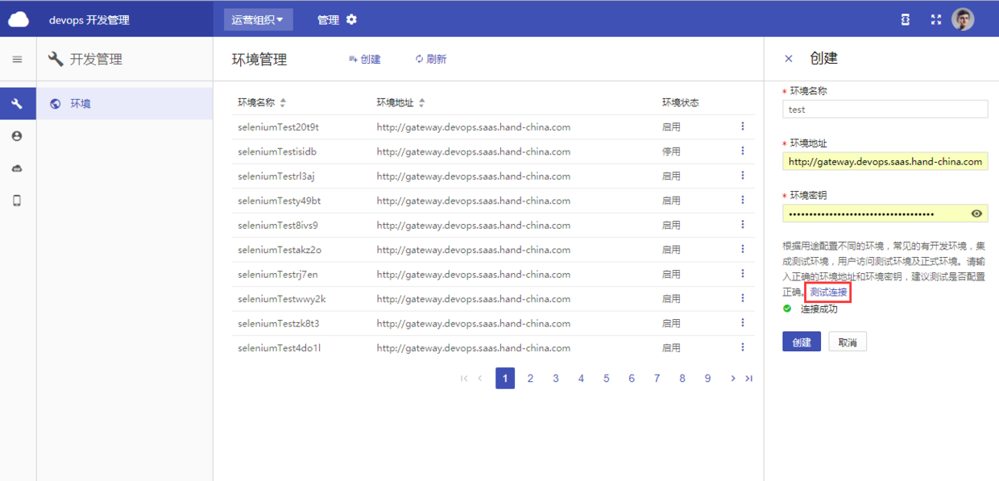

### 编辑环境信息

1. 点击 `编辑` ，进入环境编辑界面。

    

1. 对环境信息进行修改，如环境名称，点击 `保存` 按钮，修改完成。

    

1.  “环境名称” 修改完成。

    

### 停用环境

1.  点击 `停用` 。

    

1.  环境 “Charlietest” 已停用，停用后，该环境将不可使用。

    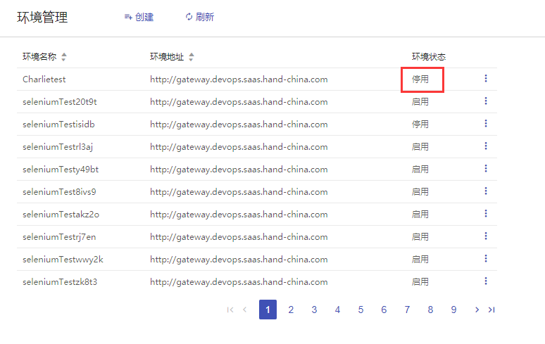

### 环境启用

1.  点击 `启用` 。

    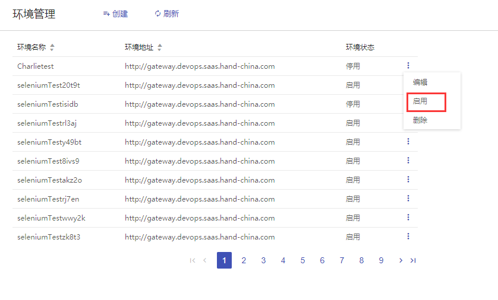

1.  环境 “Charlietest” 已启用，启用后，该环境可正常使用。

    

### 环境删除

1.  点击 `删除` 。

    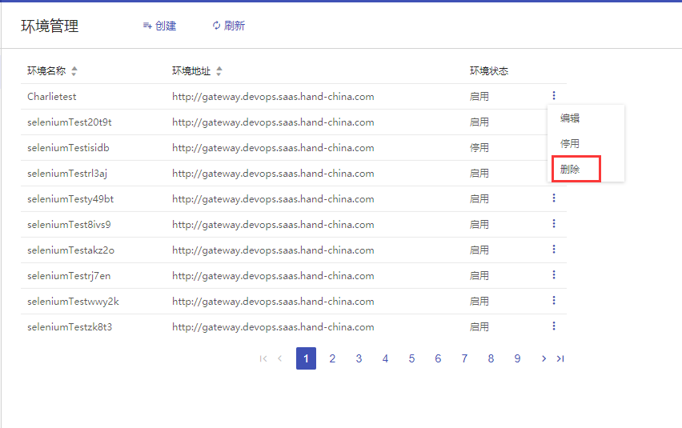

1.  再次确认，点击 `删除` 。

    

## 用户组管理

  - **菜单层次**：组织层
  - **菜单路径**：用户管理 > 用户组。

### 创建用户组

点击 `创建` ，输入 “用户组编码” ， “用户组名” ，“用户组描述” ，点击 `创建` ，用户组创建完成。

  

### 编辑用户组

1.  点击 `编辑` 。

    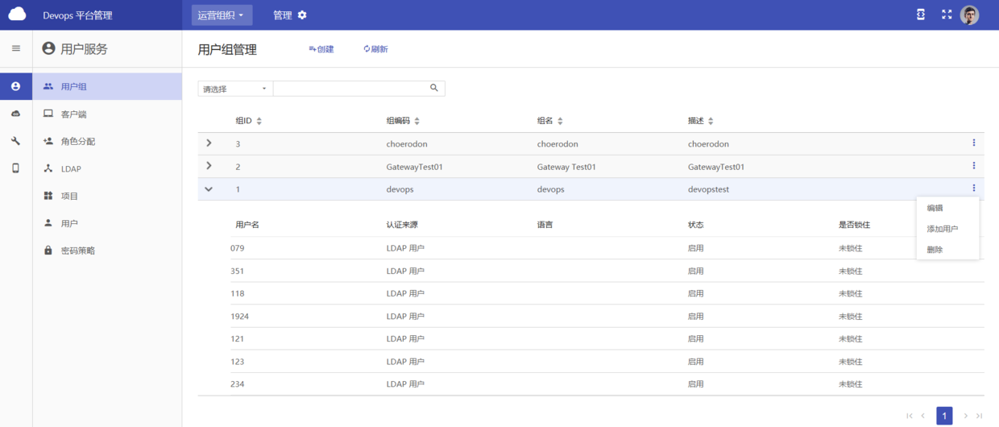

1.  修改用户组信息，点击 `编辑` 。

    

### 添加用户组用户 

1.  点击 `添加用户` 。

    

1.  点击 `添加` ，勾选需要添加到该用户组的用户。

    

### 删除用户组

点击 `删除` ，删除当前用户组。

  

## 1.  敏捷管理
## 1.1. 故事地图  

  - **菜单层次**：组织层。  
  - **菜单路径**：项目>敏捷管理>用户故事>故事地图。
  
  >在开规划会议之前,用户可以按照角色,活动,任务分类来规划roadmap,整理用户故事,记录的用户故事将会被同步到gitlab的issue上,项目干系人可以在issue下放进行评论,对用户故事展开讨论。

  
### 1.1.1. 使用故事地图 

 

1.  添加角色
    >角色:提出用户需求的人或者用户需求是基于哪类用户考虑的。例如敏捷开发有三种角色，po，master和项目开发人员。
    
    点击<创建角色>鼠标光标会变为"加号",当出现"加号"图标时,用户在角色这一行任意位置单击,即可添加角色。  

    
  
1.  添加活动
    > 活动:基于某一个角色下，具体的用户场景。  
    点击<创建活动>鼠标光标会变为"加号",当出现"加号"图标时,用户在活动这一行任意位置单击,即可添加活动。  

1.  添加任务
    >任务:用户场景的细化。
  
    点击<创建任务>鼠标光标会变为"加号",当出现"加号"图标时,用户在任务这一行任意位置单击,即可添加任务。  

  
1.  创建发布计划
  
    点击<创建发布计划>,即可在用户故事地图上面生成对应的发布计划,依次默认命名为发布计划1,发布计划2.....,如果想修改发布计划名称或者删除发布计划,点击发布计划名称旁边的三点符号,可进行修改或者删除。处于安全考虑,已经有用户故事的发布计划,需要先删除里面的用户故事,才能删除整个发布计划

    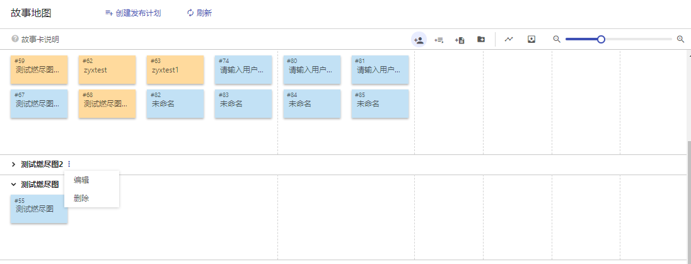

  
1.  创建卡片  
  
    在故事地图界面移动鼠标,见到卡片创建的提示时,点击提示卡中间的文字部分,也可以创建相应的卡片,比如角色，活动，任务，用户故事。
    >用户故事:具体的需求。

    

    

    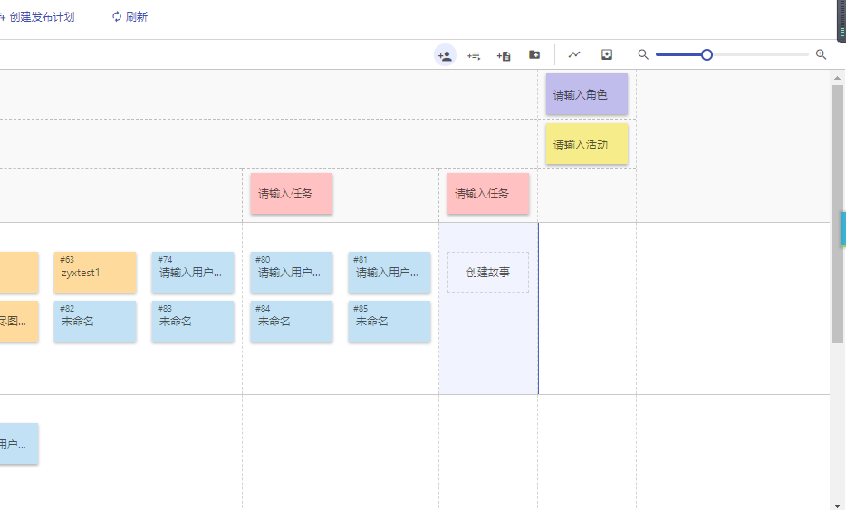
  
### 1.1.2.  故事地图工具栏介绍  

  
1. 未规划区的使用
  
    点击<未规划区>,会出现一个侧边栏,如下图所示,在侧边栏中会放入您在其他界面创建的未选择发布计划的故事,比如您在用户故事界面创建了一个未选择发布计划的用户故事,就会以一张故事卡的形式出现在此处,顶部的搜索和过滤可以进行高级搜索,找到您想要的卡片,您考虑好此故事放在哪个发布计划下比较合适时,也可以拖动到具体的发布计划下。

    

    

  
1. 数据统计
  
    此项目下的数据进度的分析，可一键从此入口进入，也可去数据洞察界面选择具体项目查看。

    

    

  
1. 导出为图片
  
    点击<导出为图片>,即可把当前的地图以图片形式保存下来，导出格式为png。

    

  
1. 放大缩小
  
    点击放大搜索标志，或者拖动放大缩小的滚动条，都可完成整个地图的放大缩小。

  
    

## 1.2.  用户故事  

  - **菜单层次**：组织层。
  - **菜单路径**：项目>敏捷管理>用户故事>用户故事。
  
  > 用户故事界面是用户故事界面的列表展现形式,在这里可以集中查看您创建的所有的用户故事,以及其下的任务缺陷等,方便快捷。

## 1.2.1. 用户故事界面功能详解  

  
1.  创建故事
  
    点击<创建故事>,出现详情信息编辑的窗口,在窗口中进行编辑,编辑完成之后点击保存。

    

  
1.  高级搜索
  
    点击<过滤>可以进行高级搜索
    
    

  
1.  操作
  - 删除
    
    未进入冲刺的用户故事可以删除。
  - 快捷创建任务
    
    可以快捷创建用户故事下面的任务。
  - 快捷创建缺陷
    
    可以快捷创建用户故事下面的缺陷。

    
  
## 1.3.  冲刺
  
  - **菜单层次**：组织层。
  - **菜单路径**：项目>敏捷管理>冲刺和看板>冲刺。
  
  > 在冲刺中，可方便为您管理一个迭代周期内要完成的故事，并为您进行后台数据监测，可视化故事完成的情况，冲刺作为用户故事地图和看板的衔接环节，开启冲刺之后才能使用看板的全部功能。

## 1.3.1. 冲刺界面功能详解
  
1. 创建冲刺
  
    点击<创建冲刺>,选择发布计划和预计的冲刺起止时间,即可创建一个新的冲刺。
  
    

  
1. 搜索
  
    可以在工具栏进行搜索。
  
    
  
1. 操作
    - 删除
      
      可以删除这个冲刺。
    - 状态切换
      
      可以快捷开启或者关闭冲刺，完成状态切换。
    - 编辑
      
      可以修改冲刺的具体信息。
      
    

 
1. 进入冲刺详情
  
   点击冲刺的名称，即可进入冲刺详情。
    - 开启/关闭冲刺
      
      点击<开启冲刺>可开启当前冲刺,开启之后,数据洞察就开始记录当前冲刺的数据。冲刺内添加的故事也会自动导入看板中,并放在第一列。
    点击<关闭冲刺>可关闭当前冲刺，关闭之后不能再开启。
    - 添加故事
      
      选择故事来源,从故事地图,或者未规划的故事中,勾选需要导入的故事,点击确定,添加到冲刺中,添加进冲刺的故事,在故事地图界面的颜色会与没有导入冲刺的颜色有一个变化。
    - 创建任务
      
      可以创建进入到冲刺中的用户故事下的具体任务。
    - 创建缺陷
      
      可以创建用户故事下或者任务下测试出现的bug。

    
  
    - 筛选
      
      可以对故事，任务和缺陷进行分类筛选。
    

    - 操作
      
      可以把导入冲刺的故事移除，移除后不会在故事地图里面删除，只是故事地图中的卡片颜色会变为未导入状态。也可以导入到其他冲刺中。

    
  
## 1.4.  看板
  
  - **菜单层次**：组织层。 
  - **菜单路径**：项目>敏捷管理>冲刺和看板>看板。
  
  > 开启冲刺之后才能使用看板的全部功能。看板可以取代物理看板，也可以可视化您的工作流，同时后台会记录所以操作的时间数据，帮您完成数据分析和记录工作。
  
## 1.4.1. 看板管理界面功能详解
  
1.  选择模板
  
    进入看板之后，先根据您的需要，选择一个看板模板，单击某个模板，可查看详情，双击就会为您选择当前模板并打开，看板界面没有卡片时，您也可以更换模板。

      

    
  
1.  使用看板
  
    进入看板之后，您在当前开启的冲刺中添加的故事，会自动为您导入到当前看板，并放在SprintBacklog里面（第一列）
    - 创建卡片
    
    点击<创建卡片>,出现卡片详情编辑的窗口,选择卡片类型,故事,任务,缺陷,可创建对应类型的卡片,创建的卡片会同步到故事地图界面,放在当前发布计划的第一个角色的第一个任务列里。

    

    
    - 看板绘制
      
      
      点击<看板绘制>进入看板编辑界面
      
      1)增加列
      
      2)绘制泳道
      
      3)增加/减少列高
      
      4)撤销/恢复
      
      5)保存
      
      6)在制品和起始列设置

      

    - 拖动故事卡
    - 故事卡的子卡(任务卡/bug卡)的操作
  
## 1.5.  任务
  
  - **菜单层次**：组织层。
  - **菜单路径**：项目>敏捷管理>任务和漏洞>任务。
  
  > 可以查看您创建的所有任务，可视化您的任务流，同时后台会记录所以操作的时间数据，帮您完成数据分析和记录工作。
  
## 1.5.1. 任务管理界面功能详解
- 查看任务
  
  在任务界面,您可以查看您所有创建的任务,并且可以高级搜索您要找的任务。
- 操作
  
  可以在<操作>中完成删除,快捷创建缺陷的快捷操作

  
  
## 1.6.  漏洞
  
  - **菜单层次**：组织层。
  - **菜单路径**：项目>敏捷管理>任务和漏洞>漏洞。
  
  > 可以查看您创建的所有漏洞。
  
## 1.6.1. 漏洞管理界面功能详解
  - 查看缺陷
    
    在任务界面,您可以查看您所有创建的缺陷,并且可以高级搜索您要找的缺陷。
  - 操作
    
    可以在<操作>中完成删除缺陷。

  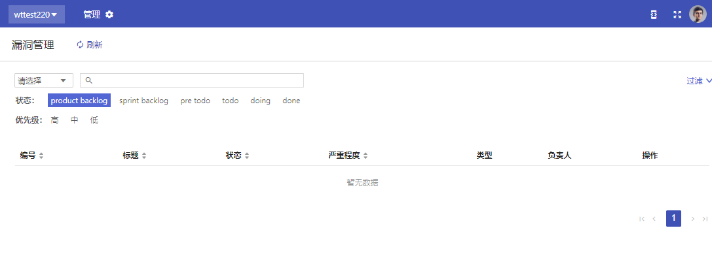

