# 系统配置

## 角色管理

  - **菜单层次**：全局层。
  - **菜单路径**：管理 > 角色。

  当API发送请求时，通过授予用户角色来授予适当的权限来使用资源，该篇介绍如何进行角色的创建与权限配置。

### 新建角色

1. 点击 `创建` 。

    

1. 输入 “角色名” ， “角色编码” ，设置是否可编辑以及是否启用，点击 `添加权限`。

    

    注：[API权限列表]()

1. 选择所需相应权限，点击 `确定` ，进行创建。

    

### 编辑角色权限配置

1. 针对已存在的角色，点击 `编辑` ，或者从详情界面点击 `编辑` 。

    

1. 对角色相关信息进行修改，以及权限进行修改，点击 `添加权限` 。

    

1. 添加或删除一个或多个权限，点击 `确定` 。

    

### 停用角色

- 点击 `停用` ，该角色将不可分配给用户。

  

### 启用角色

  > 点击 `启用` ，该角色正常使用，可以分配给相应用户。  
  注：现有角色需手动配置权限列表

### 角色权限说明

角色名称 | 权限名称 | 权限描述 | 权限层级
--- | --- | --- | ---
项目创建者 | hap-user-service.password-policy.queryOrganization | 查询目标组织密码策略 | organization
项目创建者 | hap-devops-service.environment.listEnvironment | 查询全部环境信息 | organization
项目创建者 | hap-devops-service.environment.createEnvironment | 创建环境 | organization
项目创建者 | hap-devops-service.environment.checkEnvironmentByName | 检查环境名是否可用 | organization
项目创建者 | hap-devops-service.environment.listEnvironmentByPageSize | 分页查询环境信息 | organization
项目创建者 | hap-devops-service.environment.getEnvironmentByEnvironmentId | 环境管理详情 | organization
项目创建者 | hap-devops-service.environment.updateEnvironment | 更新环境 | organization
项目创建者 | hap-devops-service.environment.deleteEnvironmentByEnvironmentId | 删除环境 | organization
项目创建者 | hap-devops-service.project.checkProject | 校验项目code,name是否重复 | organization
项目创建者 | hap-user-service.project.select | 分页查询项目 | organization
项目创建者 | hap-user-service.project.create | 添加项目，organization id不需要，强制当前用户所属organization | organization
项目创建者 | hap-user-service.project.checkProjectCode | checkProjectCode | organization
项目创建者 | hap-user-service.project.queryOrganizationProject | 根据组织id查询项目 | organization
项目创建者 | hap-user-service.user.select | 分页查询 | organization
项目创建者 | hap-user-service.user.create | 新增用户 | organization
项目创建者 | hap-user-service.user.query | 根据删除组织下所有用户 | organization
项目创建者 | hap-user-service.user.updateUser | 通过用户id查询用户 | organization
项目创建者 | hap-user-service.organization.query | 根据组织id查询组织 | organization
项目创建者 | hap-user-service.role.selectOrganizationRole | 查询可分配组织角色列表 | organization
项目创建者 | hap-user-service.project.update | 根据id修改项目信息，只能修改自己组织项目 | organization
项目所有者 | hap-user-service.project.query | 按照Id查询项目，只能查询自己组织项目 | project
项目所有者 | hap-user-service.member-role-project.select | 查询项目成员角色 | project
项目所有者 | hap-user-service.member-role-project.create | 项目层新增成员角色 | project
项目所有者 | hap-user-service.member-role-project.update | 更新项目层成员角色 | project
项目所有者 | hap-user-service.member-role-project.createSingle | 项目层新增成员角色 | project
项目所有者 | hap-user-service.member-role-project.delete | 删除项目层成员角色 | project
项目所有者 | hap-user-service.role.selectProjectRole | 查询可分配项目角色列表 | project
项目所有者 | hap-user-service.role.selectProjectRoleGroupByService | 查询可分配项目角色列表（查询结果以服务分组） | project
源代码管理员 | hap-user-service.project.query | 按照Id查询项目，只能查询自己组织项目 | project
项目成员 | hap-user-service.project.query | 按照Id查询项目，只能查询自己组织项目 | project
看板所有者 | hap-user-service.project.query | 按照Id查询项目，只能查询自己组织项目 | project
看板成员 | hap-user-service.project.query | 按照Id查询项目，只能查询自己组织项目 | project
开发监控 | hap-user-service.project.query | 按照Id查询项目，只能查询自己组织项目 | project
部署管理员 | hap-user-service.groups.select | 查询Group | organization
部署管理员 | hap-user-service.groups.create | 创建Group | organization
部署管理员 | hap-user-service.groups.query | 查询Group | organization
部署管理员 | hap-user-service.groups.update | 更新Group | organization
部署管理员 | hap-user-service.groups.delete | 删除Group | organization
部署管理员 | hap-user-service.user-groups.insertUserGroups | 创建userGroups | organization
部署管理员 | hap-user-service.user-groups.delete | 删除userGroups | organization

## 用户管理

  - **菜单层次**：组织层。
  - **菜单路径**：IAM > 用户管理。

  > 面向平台管理员提供用户管理功能，可以新建用户，进行用户信息维护等。  
   注：用户可由其他系统批量导入。

### 新建用户

1.  点击`创建`按钮。

    

1.  输入用户相关信息，点击`创建`按钮，完成创建。

    

1.  新建的用户“张三”已在用户列表中，gitlab自动生成用户“张三”。。

    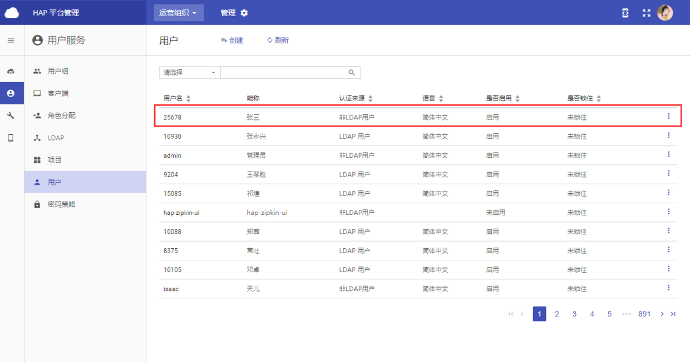

### 查看用户详情

1.  点击`详情`，进入用户详情界面。

    

1.  查看所需信息。

    

### 编辑用户信息

1.  点击`编辑`，进入用户编辑界面。

    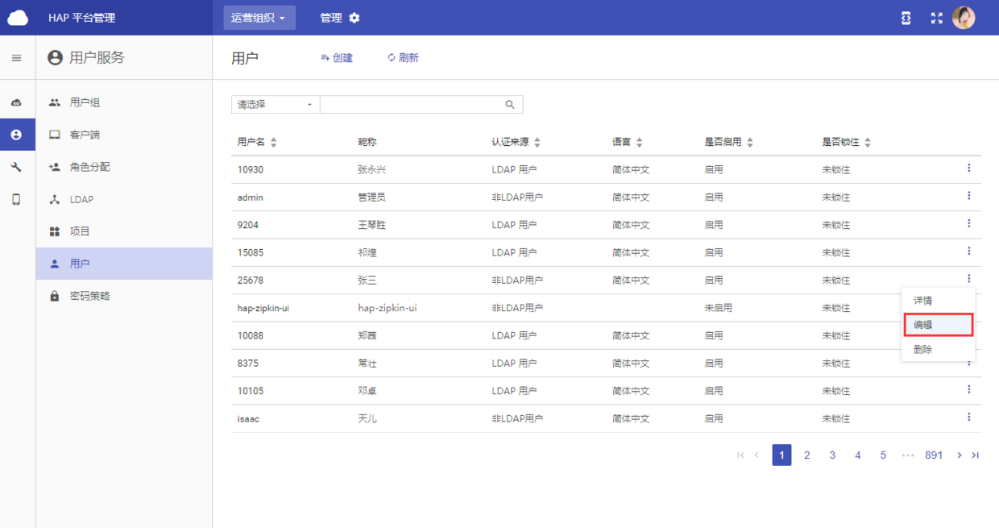

    或从用户详情界面点击`编辑`按钮，进入用户编辑界面。

    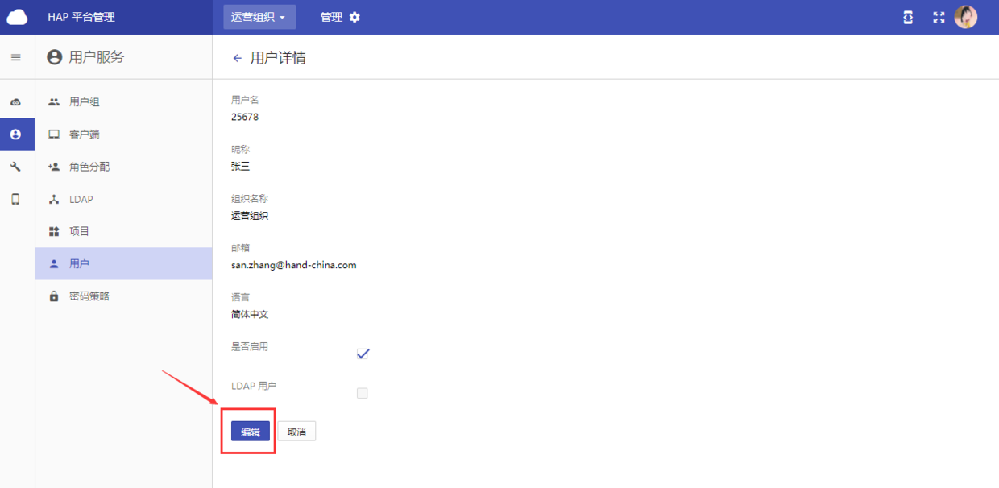

1.  对用户信息进行修改，点击`保存`按钮，用户信息修改完成。

    

### 删除用户

1.  点击`删除`。

    

1.  再次点击`删除`按钮，用户删除成功。

    

## 角色分配

  - **菜单层次**：组织层/项目层
  - **菜单路径**：IAM > 角色分配。

  > 面向平台管理员、项目所有者提供的权限管理，可以在组织或项目内添加成员，为其分配适当的角色，也可以调整现有成员的角色，可以有适当的权限使用资源。

### 添加角色

1.  若需要分配的用户不在该组织/项目中，点击 `添加` 按钮进行角色添加。

    

    例如：当用户“25777”不属于“演示项目0131”项目时，点击`添加`，输入用户名，为该用户分配角色权限。

    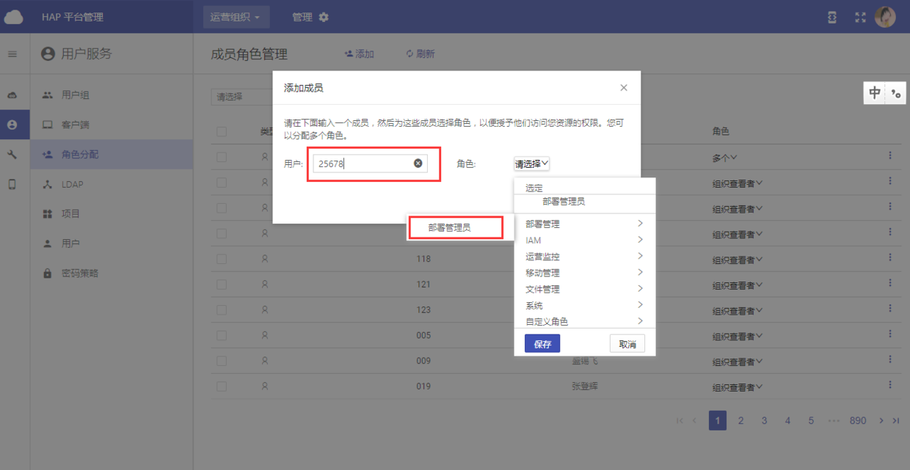

1.  若用户存在于成员角色管理列表中，无需点击 `添加` ，点击 `▼` ，选择一个或多个角色进行分配。

    

    例如，创建用户完成后，平台会自动分配 “组织查看者” 的角色，该用户存在于成员角色管理列表中，直接进行角色分配，点击 `保存` 按钮，完成角色修改。

    

    

_小tips：找不到用户怎么办？  
直接在搜索框内输入用户名或昵称，回车一下就搞定啦~_

  

注：**角色权限列表**

角色 | 权限 | 层级
--- | --- | ---
平台管理员 | 菜单管理、角色管理、用户管理（初始化导入）、角色分配（组织层）及除服务发布之外所有功能 | 系统层
项目创建者 | 用户管理、项目管理、环境管理、用户组管理 | 组织层
部署管理员 | 资源管理、网关管理、域名管理、服务管理、服务部署、部署详情（阶段及日志）、设置自动部署 | 组织层
项目所有者 | 角色分配（所在项目下）服务创建、服务详情查看、分支管理、服务版本、代码质量查看、服务发布、设置自动发布 | 项目层
源代码管理员 | 服务创建、服务详情查看、分支管理、服务版本、代码质量查看、服务发布 | 项目层
项目成员 | 服务详情查看、分支管理、服务版本、代码质量查看、服务发布 | 项目层
看板项目所有者 | 故事管理、冲刺管理、任务和缺陷 | 项目层
看板成员 | 故事管理、冲刺管理、任务和缺陷 | 项目层
开发监控查看者 | 全流程信息监控查看 | 项目层

### 删除角色

1.  点击 `删除` 。

    

1.  点击 `删除` ，用户从该组织/项目移除成功。

    

## 项目管理

  - **菜单层次**：组织层
  - **菜单路径**：IAM > 项目。

  > 根据企业产品研发情况拆分团队，建议采用敏捷项目管理团队为一个项目单位，项目管理可以提供项目创建、项目查询、项目编辑等功能。

### 新建项目

1.  点击 `创建` 按钮。

    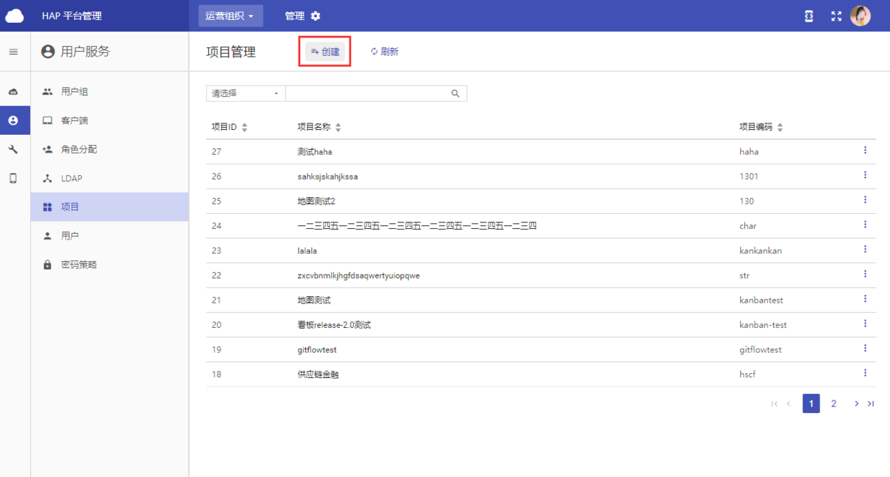

1.  输入 “项目编码” 和 “项目名称” ，点击 `创建` 按钮。

    

1.  新建项目 `“演示0131”` 已在项目管理列表中， gitlab自动对应生成group `“演示0131”` 。

    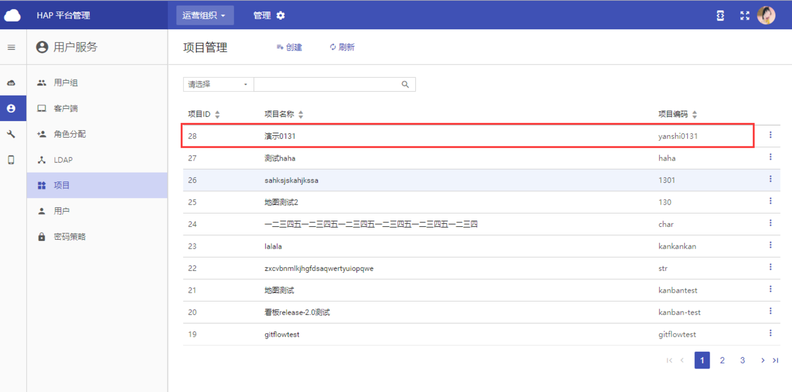

### 编辑项目信息

1.  点击 `编辑` ，进入项目编辑界面。

    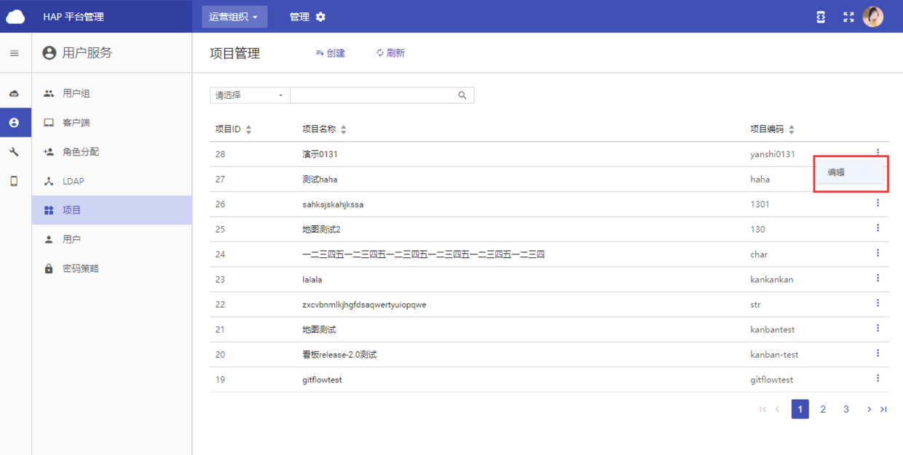

1.  对 `“项目名称”` 进行修改，点击 `保存` 按钮。

    

### 禁用/启用项目

点击 `禁用` ，项目禁用后，该项目下的其他操作将无法进行。。

  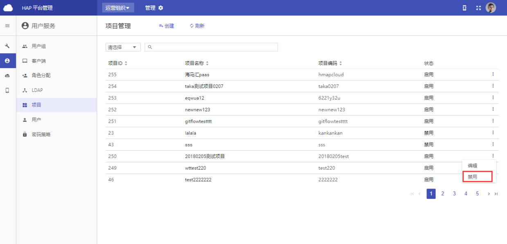

### 启用项目

点击`启用`，启用后，该项目恢复正常使用。

  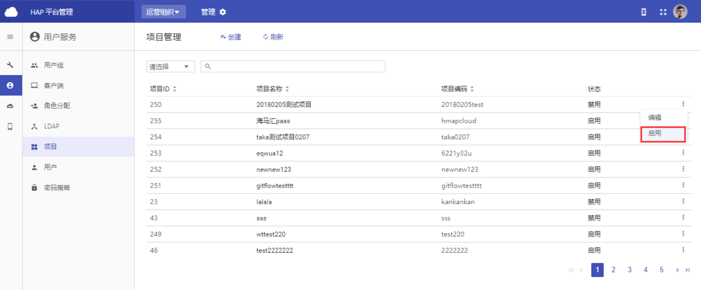

## 环境管理

  - **菜单层次**：组织层/项目层
  - **菜单路径**：开发管理 > 环境。

  > 面向平台管理员和项目创建者，根据用途的不同配置相对应的环境信息。可以创建环境，删除环境，及对环境详情信息进行编辑修改。  
  常见环境包含：测试环境，UAT环境及正式环境等。

### 创建环境

1. 点击 `创建` 按钮。

    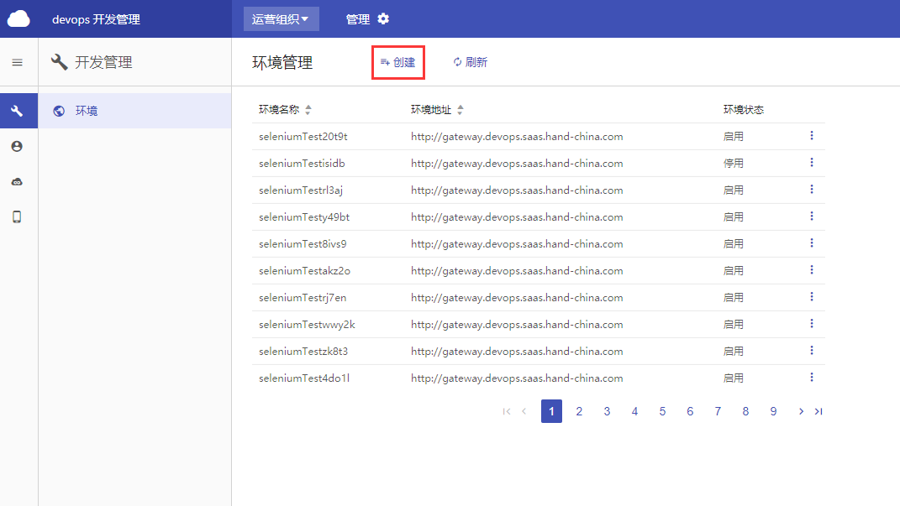

1. 输入 “环境名称” 、 “环境地址” 以及 “环境密钥” ，点击 `测试连接` ，若环境地址、秘钥配置正确，会提示“连接成功”；若看到提示信息为“连接失败”，请修改为正确的环境地址或秘钥，点击 `创建` 按钮。

    

### 编辑环境信息

1. 点击 `编辑` ，进入环境编辑界面。

    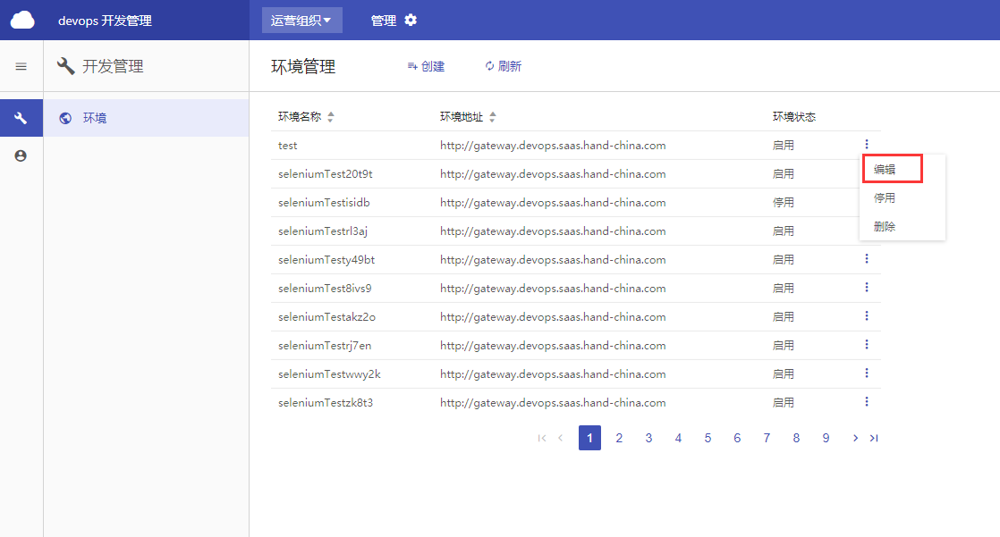

1. 对环境信息进行修改，如环境名称，点击 `保存` 按钮，修改完成。

    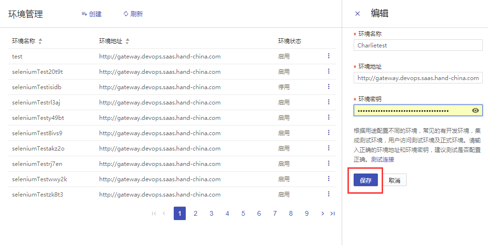

1.  “环境名称” 修改完成。

    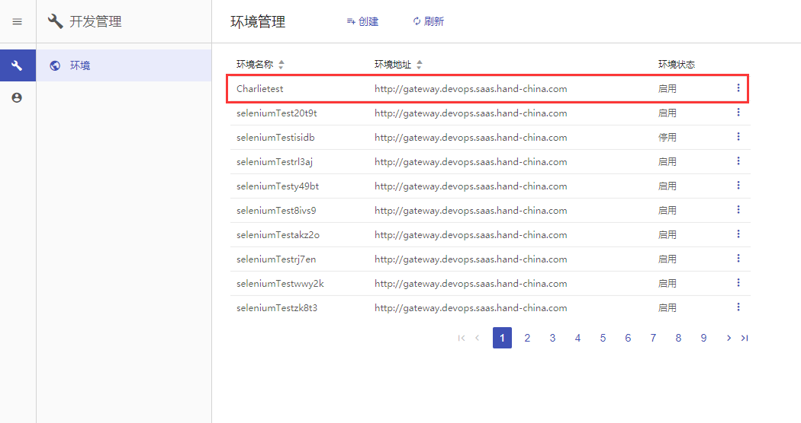

### 停用环境

1.  点击 `停用` 。

    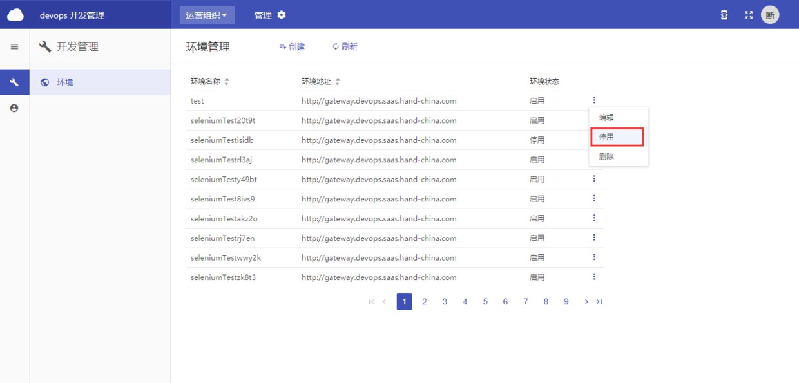

1.  环境 “Charlietest” 已停用，停用后，该环境将不可使用。

    

### 环境启用

1.  点击 `启用` 。

    

1.  环境 “Charlietest” 已启用，启用后，该环境可正常使用。

    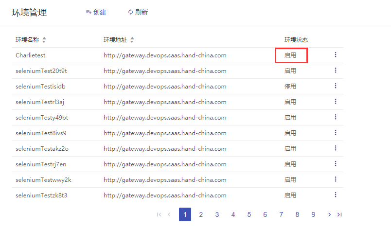

### 环境删除

1.  点击 `删除` 。

    

1.  再次确认，点击 `删除` 。

    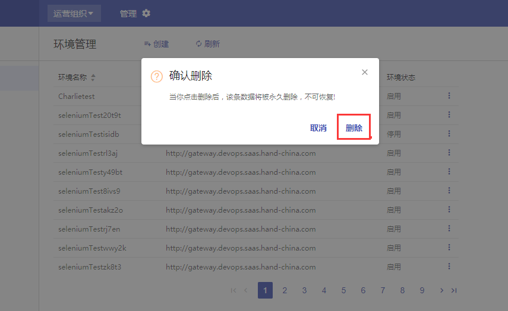

## 用户组管理

  - **菜单层次**：组织层
  - **菜单路径**：用户管理 > 用户组。

### 创建用户组

点击 `创建` ，输入 “用户组编码” ， “用户组名” ，“用户组描述” ，点击 `创建` ，用户组创建完成。

  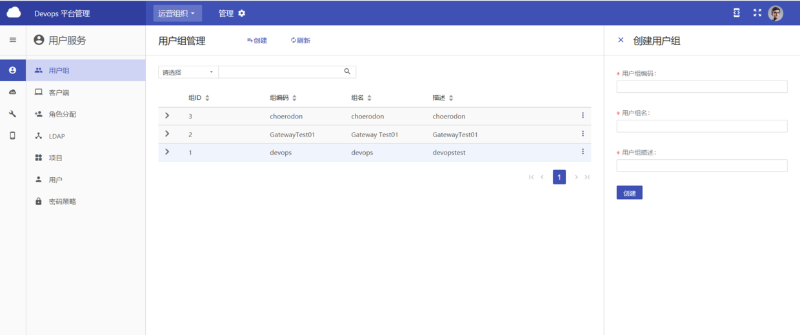

### 编辑用户组

1.  点击 `编辑` 。

    

1.  修改用户组信息，点击 `编辑` 。

    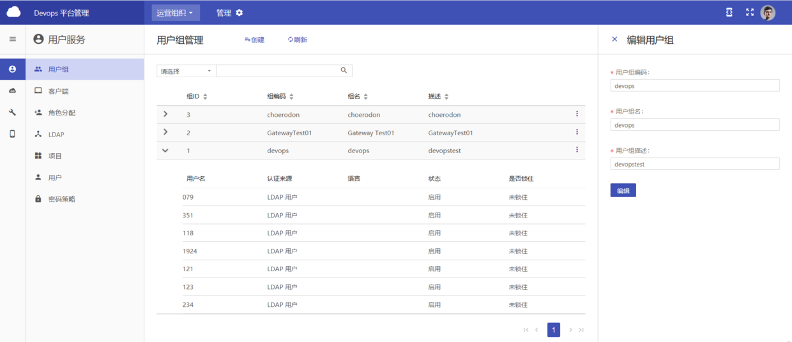

### 添加用户组用户 

1.  点击 `添加用户` 。

    

1.  点击 `添加` ，勾选需要添加到该用户组的用户。

    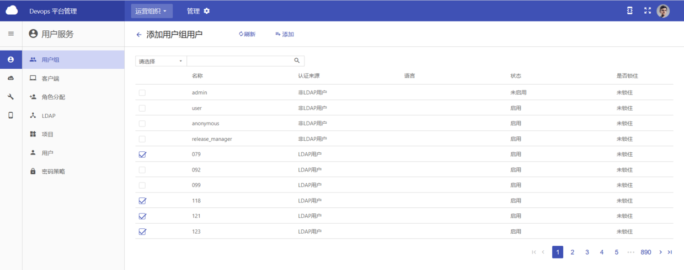

### 删除用户组

点击 `删除` ，删除当前用户组。

  
